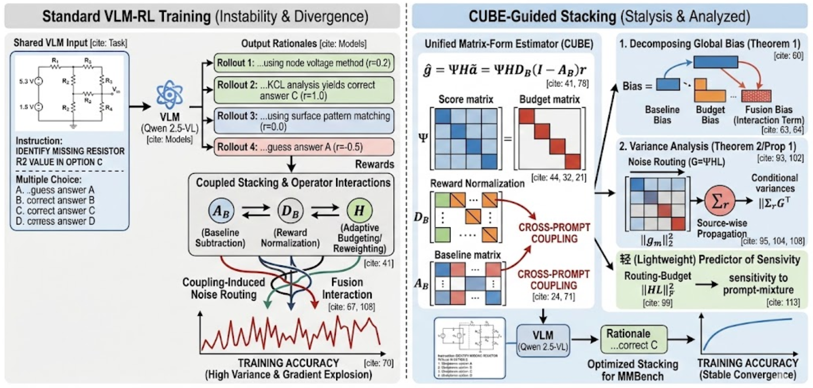
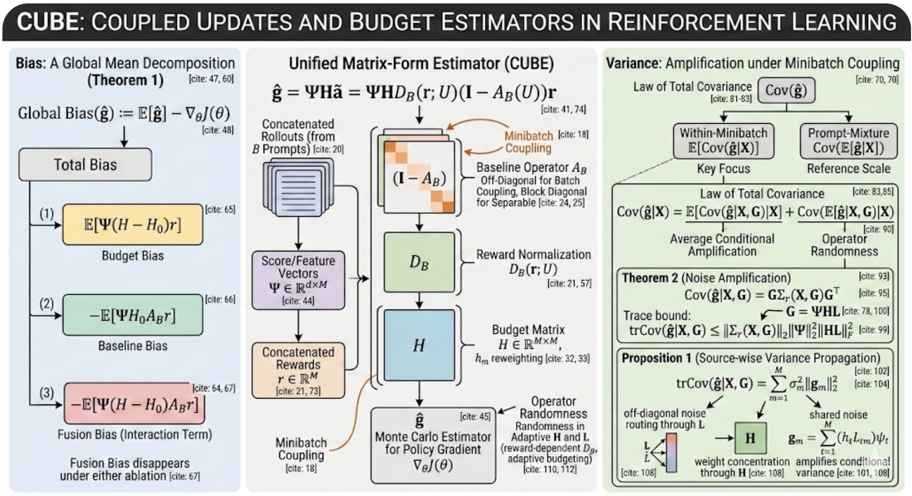

# CUBE: Coupled Updates and Budget Estimators in Reinforcement Learning

> **한국어** | **[English README](README.md)**

---

## 목차

- [개요](#개요)
- [핵심 기여](#핵심-기여)
- [논문 그림](#논문-그림)
- [코드 구조](#코드-구조)
- [베이스라인 및 예산 방법](#베이스라인-및-예산-방법)
- [코드 수정 사항 (v10)](#코드-수정-사항-v10)
- [코드 수정 사항 (v9)](#코드-수정-사항-v9)
- [코드 수정 사항 (v8)](#코드-수정-사항-v8)
- [코드 수정 사항 (v7)](#코드-수정-사항-v7)
- [코드 수정 사항 (v6)](#코드-수정-사항-v6)
- [코드 수정 사항 (v5)](#코드-수정-사항-v5)
- [코드 수정 사항 (v4)](#코드-수정-사항-v4)
- [코드 수정 사항 (v3)](#코드-수정-사항-v3)
- [데이터셋 및 모델](#데이터셋-및-모델)
  - [시뮬레이션 데이터 (현재 사용 중)](#시뮬레이션-데이터-현재-사용-중)
  - [VLM 벤치마크 데이터셋](#vlm-벤치마크-데이터셋)
  - [모델 정보](#모델-정보)
  - [저장 경로 요약](#저장-경로-요약)
- [빠른 시작](#빠른-시작)
- [실험 실행 방법](#실험-실행-방법)
- [인용](#인용)

---

## 개요

**CUBE** (**C**oupled **U**pdates and **B**udget **E**stimators)는 검증 가능한 보상 기반 강화학습(RLVR)에서 그래디언트 추정기를 분석하기 위한 통합 이론 및 실험 프레임워크입니다. 특히 멀티모달 비전-언어 모델(VLM)에서의 RL 훈련 안정성에 초점을 맞춥니다.

현대 RLVR 파이프라인은 다음 두 요소를 결합합니다:
- **베이스라인 방법** (REINFORCE, GRPO, RLOO, STV) — 분산 감소를 위한 제어 변량
- **예산 모듈** (프롬프트 스킵, 롤아웃 배분, 서브셋 선택) — 연산 자원 제어

CUBE는 전체 추정기를 다음과 같은 **행렬 형태**로 표현합니다:

$$\hat{g} = \Psi H \tilde{a} = \Psi H D_B (I - A_B) r$$

| 기호 | 의미 |
|------|------|
| $\Psi \in \mathbb{R}^{d \times M}$ | 롤아웃별 스코어(로그 확률 그래디언트) 행렬 |
| $H \in \mathbb{R}^{M \times M}$ | 대각 예산 행렬 |
| $A_B \in \mathbb{R}^{M \times M}$ | 베이스라인 연산자 (프롬프트 간 결합 가능) |
| $D_B \in \mathbb{R}^{M \times M}$ | 정규화 연산자 |
| $r \in \mathbb{R}^M$ | 연결된 보상 벡터 |

---

## 핵심 기여

### 1. 정확한 전역 편향 분해 (정리 1)

$$\mathbb{E}[\hat{g}] - \nabla_\theta J(\theta) = \underbrace{\mathbb{E}[\Psi(H-H_0)r]}_{\text{예산 편향}} - \underbrace{\mathbb{E}[\Psi H_0 A_B r]}_{\text{베이스라인 편향}} - \underbrace{\mathbb{E}[\Psi(H-H_0)A_B r]}_{\text{융합 편향}}$$

**융합 편향(Fusion Bias)**은 예산과 베이스라인이 **동시에** 활성화될 때만 나타나는 교차 항입니다. 각 모듈을 개별적으로 절제(ablation)해서는 탐지할 수 없습니다.

### 2. 잡음 증폭 경계 (정리 2)

$$\mathrm{tr}\, \mathrm{Cov}(\hat{g} \mid X, G) \leq \|\Sigma_r\|_2 \cdot \|\Psi\|_2^2 \cdot \|HL\|_F^2$$

$\|HL\|_F^2$는 라우팅($L$)과 가중치 집중($H$)을 통한 분산 증폭의 경량 프록시입니다.

### 3. 소스별 분산 전파 (명제 1)

$$\mathrm{tr}\, \mathrm{Cov}(\hat{g} \mid X, G) = \sum_{m=1}^M \sigma_m^2 \|g_m\|_2^2, \quad g_m = \Psi H L e_m$$

각 좌표 잡음 소스 $\sigma_m^2$는 라우팅과 예산 증폭에 의해 가중된 항을 기여합니다.

---

## 논문 그림

### 그림 1: CUBE 프레임워크 개요

<p align="center">
  
</p>

**그림 1.** CUBE 프레임워크 개요. 중앙 파이프라인은 베이스라인과 예산 선택을 포함하는 통합 행렬 형태 몬테카를로 추정기를 보여줍니다. 왼쪽 패널은 전역 편향의 정확한 분해(정리 1)를 나타내며 총 편향을 예산 편향, 베이스라인 편향, 융합 상호작용 항으로 분리합니다. 오른쪽 패널은 미니배치 결합 하에서의 분산 증폭(정리 2, 명제 1)을 보여주며, 비대각 잡음 라우팅과 가중치 집중이 조건부 분산을 증폭시키는 방식을 강조합니다.

---

### 그림 2: VLM-RL 진단 및 완화

<p align="center">
  
</p>

**그림 2.** CUBE 프레임워크를 이용한 VLM에서의 강화학습 불안정성 진단 및 완화. 왼쪽 패널은 표준 VLM-RL 훈련에서 베이스라인, 정규화, 적응적 예산 연산자의 결합 스태킹이 잡음 라우팅과 융합 상호작용을 유발하여 높은 분산과 훈련 발산으로 이어지는 과정을 보여줍니다. 오른쪽 패널은 CUBE 행렬 형태 분석을 적용하여 편향을 분해하고 소스별 분산 전파를 추적함으로써 멀티모달 추론 벤치마크에서 안정적인 수렴을 가능하게 합니다.

---

## 코드 구조

```
cube/
├── cube/
│   ├── estimators/          # 베이스라인 그래디언트 추정기
│   │   ├── base.py          # 추상 BaseEstimator, RolloutBatch
│   │   ├── reinforce.py     # REINFORCE (A_B=0, D_B=I, H=H0)
│   │   ├── grpo.py          # GRPO (그룹 평균 + 표준편차 정규화)
│   │   ├── rloo.py          # RLOO (Leave-One-Out, 자기 제외)
│   │   └── stv.py           # STV (Adaptive: (1-λ)×RLOO + λ×BLOO, James-Stein)
│   │
│   ├── budgets/             # 예산 할당 모듈
│   │   ├── base.py          # 추상 BaseBudget
│   │   ├── prompt_skip.py   # 저분산 프롬프트 스킵
│   │   ├── rollout_alloc.py # 비균일 롤아웃 배분
│   │   └── subset_select.py # 상위-k 롤아웃 선택
│   │
│   ├── metrics/             # 편향 / 분산 측정
│   │   ├── bias.py          # 편향 분해 (정리 1)
│   │   └── variance.py      # 분산 분해 + HL 프록시 (정리 2)
│   │
│   ├── models/
│   │   └── vlm_wrapper.py   # HuggingFace VLM 래퍼
│   │
│   └── utils/
│       ├── probe.py         # 스칼라 투영을 위한 프로브 벡터
│       └── rollout.py       # RolloutBatch 구성 유틸리티
│
├── experiments/
│   └── run_experiment.py    # 메인 실험 실행기 (타임스탬프 디렉토리 생성)
│
├── datasets/
│   ├── download.py          # HuggingFace 데이터셋 다운로더
│   └── __init__.py
│
├── configs/
│   └── default.yaml         # 기본 하이퍼파라미터
│
├── assets/
│   ├── fig1.png             # 프레임워크 개요 그림
│   └── fig2.png             # VLM-RL 진단 그림
│
├── requirements.txt
├── setup.py
├── README.md
└── README_KR.md
```

---

## 베이스라인 및 예산 방법

### 베이스라인 방법

| 이름 | 설명 | $A_B$ | $D_B$ | 편향 특성 |
|------|------|--------|--------|----------|
| **REINFORCE** | 베이스라인 없음 | $0$ | $I$ | 참조 추정기 (편향 없음) |
| **GRPO** | 그룹 평균 + 표준편차 정규화 | 블록 대각 | 보상 의존적 | 정규화 편향 가능 |
| **RLOO** | Leave-One-Out | 블록 대각, 대각=0 | $I$ | 베이스라인 편향 = 0 |
| **STV** | Adaptive mixture: (1-λ)×RLOO + λ×BLOO (James-Stein shrinkage) | 혼합 비대각 블록 | $I$ | 프롬프트 간 적응적 결합 |

### 예산 방법

| 이름 | 설명 | $H$ 편차 | 융합 편향 |
|------|------|----------|----------|
| **없음** | $H = H_0$ | 없음 | 없음 |
| **PromptSkip** | 저분산 프롬프트 제로화 | 블록 수준 제로화 | 발생 가능 |
| **RolloutAlloc** | 비균일 $N_j$ 배분 | 비례 재가중치 | 발생 가능 |
| **SubsetSelect** | 상위-k 롤아웃 선택 | 희소 재가중치 | 세 방법 중 최대 |

---

## 코드 수정 사항 (v10)

> **커밋:** `a7f1893` → `(현재)` — budget_bias=0 전체 원인 규명, 신버전 CSV 추가 분석

### 1. 문제 제기: reward > 0인데 budget_bias=0인 케이스 1724건

v9에서 두 가지 알려진 0값 케이스를 정리했는데, 전체 CSV 데이터(구버전 400개, 신버전 14개)를 분석하자 **reward > 0이면서 budget≠none인데도 budget_bias=0인 케이스 1724건**이 확인됐습니다. 모두 `prompt_skip` 또는 `rollout_alloc` 조합이었습니다.

### 2. 원인 분석

#### 원인 A: `rollout_alloc` 구버전 버그 (v7에서 수정)

v5 이전 코드에서 `rollout_alloc`의 기준 행렬 H0가 잘못 설정돼 있었습니다. H0를 균등(1/M)으로 두지 않고 프롬프트별 할당량 N_j에 맞춘 `1/(N_j*B)`로 설정했기 때문에 `delta_H = H - H0 = 0`이 되어 **구조적으로 항상 0**이었습니다. v7에서 H0를 균등 기준으로 수정했고, 현재 코드에서는 정상적으로 비영 값이 나옵니다.

#### 원인 B: `prompt_skip`의 수학적 특성

`prompt_skip`은 **rollout 내에서 보상 분산이 0인 프롬프트(전부 맞거나 전부 틀린 그룹)를 건너뜁니다**. 이때 H와 H0의 구조:

```
건너뛰는 프롬프트(분산=0): H[m] = 0,       H0[m] = 1/(B·N)  →  delta_H = -1/(B·N)
살아남는 프롬프트(분산>0): H[m] = 1/(B·N),  H0[m] = 1/(B·N)  →  delta_H =  0
```

`budget_bias = E[Ψ · delta_H · r]`에서:
- 살아남는 프롬프트: `delta_H = 0` → 기여 = 0
- 건너뛰는 프롬프트: `delta_H ≠ 0`이지만…

**저정확도(~11%) 조건에서 건너뛰는 이유는 "전부 틀렸기" 때문(r=0).** 따라서 `delta_H × r = (-1/(B·N)) × 0 = 0`.

→ **결론: 저정확도에서 모든 항이 0이므로 budget_bias=0은 수학적으로 필연입니다.**

budget_bias가 0이 아니려면 **"전부 맞는" 프롬프트(all-correct, r=1)** 가 있어야 합니다. 그런 프롬프트는 건너뛰어지면서 `delta_H = -1/(B·N) ≠ 0`, `r = 1` → 기여 ≠ 0이 됩니다.

### 3. 확률적 분석: N에 따른 all-correct 발생률

ToyPolicy의 정확도는 약 11%입니다. 프롬프트 하나에서 N번 샘플링 시 **"전부 맞을" 확률은 0.11^N**입니다:

| N (rollouts/prompt) | P(all-correct 1개 이상) | 실험 200회 중 발생 횟수 |
|:-------------------:|:-----------------------:|:-------------------:|
| N=2 | ~2% | 35/200 (17.5%) |
| N=4 | ~0.015% | 0/200 |
| N=8 | ~0.000% | 0/200 |

**표준 설정(N=8)에서는 all-correct 프롬프트가 사실상 절대 발생하지 않습니다.** 따라서 `prompt_skip`의 budget_bias는 ToyPolicy 실험 조건에서 항상 0입니다.

### 4. 구버전 vs 신버전 CSV 분석

CSV 컬럼 형식으로 데이터를 분류해 검증했습니다:

| CSV 형식 | 파일 수 | budget_bias=0 케이스 (reward>0, budget≠none) | 원인 |
|---------|:------:|:--:|------|
| 구버전 (`budget_bias_proj_mean`) | 400개 | **1724건** | rollout_alloc 버그 + prompt_skip 수학적 특성 |
| 신버전 (`budget_bias_rms`) | 14개 | **16건** | 전부 `prompt_skip` (수학적 필연, 버그 아님) |

신버전 16건은 모두 `prompt_skip` 조합 (grpo, stv, rloo, reinforce × prompt_skip)이며, 버그가 아닌 정상 동작입니다.

### 5. 추가 발견: STV × prompt_skip에서 fusion_bias≠0

`stv × prompt_skip`은 `budget_bias=0`이지만 `fusion_bias≠0 (0.0067)` 임을 발견했습니다.

이유: fusion_bias = delta_H × A_B_r에서, STV 베이스라인의 A_B_r는 프롬프트 간 배치 통계를 반영합니다. 건너뛰는 프롬프트(r=0)라도 STV는 배치 전체 평균을 사용하기 때문에 A_B_r ≠ 0이 될 수 있습니다. 즉, 건너뛰는 프롬프트에서 `delta_H ≠ 0`이고 `A_B_r ≠ 0` → `fusion_bias ≠ 0`. 이는 STV가 프롬프트 간 정보를 공유하는 cross-prompt 추정기이기 때문입니다.

### 6. 실험으로 비영 확인: N=2 조건

N=2로 all-correct 프롬프트가 발생하는 조건에서 prompt_skip budget_bias가 실제로 비영임을 확인했습니다:

| 조건 | budget | reward_mean | budget_bias_rms | fusion_bias_rms |
|------|--------|:-----------:|:---------------:|:---------------:|
| N=8, S=2 (표준) | `prompt_skip` | 0.141 | **0.000** (수학적 필연) | 0.000 |
| N=2, S=16 (검증) | `prompt_skip` | 0.100 | **0.0066 ✓** (비영 확인) | 0.0066 |
| N=8, S=2 | `rollout_alloc` | 0.102 | **0.0429 ✓** | **0.0069 ✓** |
| N=8, S=2 | `subset_select` | 0.125 | **0.0699 ✓** | **0.0236 ✓** |

### 7. 완전한 budget_bias=0 케이스 정리

| 조건 | budget_bias | fusion_bias | 성질 |
|-----|:-----------:|:-----------:|------|
| budget = `none` | **0** | **0** | 구조적 (모든 조건에서 항상) |
| budget ≠ `none`, reward = 0 | **0** | **0** | 학습 초기 일시적 |
| `rollout_alloc` 구버전 (v6 이전) | **0** | **0** | 버그 (v7에서 수정) |
| `prompt_skip`, 저정확도 (N≥4, 약 11% 정확도) | **0** | **0** | 수학적 필연 (버그 아님) |
| STV + `prompt_skip`, 저정확도 | **0** | **비영** | STV cross-prompt 특성 |
| `rollout_alloc`/`subset_select`, reward > 0 | **비영** | **비영** | 정상 측정 |
| `prompt_skip`, 고정확도 (all-correct 프롬프트 존재) | **비영** | **비영** | 정상 측정 |

---

## 코드 수정 사항 (v9)

> **커밋:** `6f7cc63` — budget/fusion bias = 0 원인 분석·수정, `train_step_vlm` OOM 수정

### 1. budget_bias / fusion_bias가 항상 0으로 나오는 이유 (v9 당시 알려진 케이스)

실험 결과를 보다 보면 `budget_bias`와 `fusion_bias`가 0으로 나오는 경우가 자주 있는데, 이는 **코드 버그가 아니라** 아래 두 가지 수학적으로 정확한 상황 때문입니다.

**상황 1: budget=`none`으로 실험한 경우 (항상 0)**

budget 모듈이 없으면(`none`), 예산 행렬 H가 기준값 H0와 완전히 같습니다.
따라서 `delta_H = H - H0 = 0`이 되고:
- `budget_bias = delta_H × r = 0 × r = 0` — budget이 없으니 budget bias도 당연히 0
- `fusion_bias = delta_H × A_B_r = 0 × A_B_r = 0` — 마찬가지로 0

→ **`none` budget으로 돌리면 budget_bias와 fusion_bias는 언제나 0입니다. 정상 동작입니다.**

**상황 2: non-none budget인데 reward가 모두 0인 경우 (일시적으로 0)**

VLM처럼 아직 학습이 안 된 모델은 미니배치에서 하나도 못 맞출 때가 있습니다. reward가 전부 0이면 `r = 0`이므로:
- `budget_bias = delta_H × 0 = 0`
- `fusion_bias = delta_H × A_B_r = delta_H × 0 = 0`

→ **모델이 아무것도 못 맞춘 배치에서는 bias도 측정 불가입니다. 학습이 진행될수록 해소됩니다.**

이를 한눈에 정리하면 (v9 당시 — v10에서 추가 케이스 발견):

| 실험 조건 | budget_bias | fusion_bias | 해석 |
|----------|:-----------:|:-----------:|------|
| budget = `none` | **0** | **0** | 예상된 구조적 영조건 (항상 발생) |
| budget ≠ `none`, reward = 0 | **0** | **0** | 학습 초기 일시적 현상 (경고 출력) |
| budget ≠ `none`, reward > 0 | **비영** | **비영** | 정상 측정값 (단, v10 참고) |

### 2. 추가된 경고 메시지

non-none budget인데 reward=0이면 원인을 바로 알 수 있도록 경고를 출력합니다:

```
[warn] reward=0 → budget_bias=fusion_bias=0 (trivially).
Model not yet producing correct answers for sampled prompts. Expected to resolve after training.
```

체크포인트 출력에 `budget_bias` 수치도 함께 표시하도록 변경했습니다:

```
total_bias=19.8532 | budget_bias=0.0438 | fusion_bias=0.0289 | HL=0.0000 | reward=0.500 | vr=1.000
```

### 3. `train_step_vlm` OOM 수정 (`experiments/run_vlm.py`)

`compute_vlm_weight_projs`와 동일한 문제가 `train_step_vlm`에도 있었습니다. 프롬프트당 N_j개 rollout을 한꺼번에 forward하면 이미지 인코더 activation이 N_j개 동시에 메모리에 올라가 2번째 이후 체크포인트에서 OOM이 발생했습니다. 롤아웃 1개씩 처리 + 스텝 후 그래디언트 정리로 수정:

```python
for k in range(N_j):
    log_pi_mk = compute_log_probs_batch(model, processor, [item], [resp], N=1, ...)
    loss_mk = -(log_pi_mk[0] * weights[offset + k])
    loss_mk.backward()
    del log_pi_mk, loss_mk
    torch.cuda.empty_cache()
optimizer.step()
optimizer.zero_grad()  # 스텝 후 그래디언트 정리
```

### v9 VLM 검증 결과

`grpo × subset_select` (non-none budget), M=16, B=4, S=1, K=1, T=1, R=8:

| 체크포인트 | total_bias | budget_bias | fusion_bias | reward | vr |
|:--------:|:----------:|:-----------:|:-----------:|:------:|:--:|
| step=0 | 19.85 | **0.0438 ✓** | **0.0289 ✓** | 0.500 | 1.000 |
| step=2 | 0.0000 | 0.0000 (경고 출력) | 0.0000 | 0.000 | 0.000 |

- reward=0.5인 배치 → budget_bias, fusion_bias 모두 **비영 정상 확인** ✓
- reward=0인 배치 → 경고 출력 ✓, OOM 없이 283.9s 완료 ✓

---

## 코드 수정 사항 (v8)

> **커밋:** `8b59d34`, `(현재)` — VLM OOM 수정, system prompt 추가, loss 포맷 개선, `run_vlm_batch.py` 검증

### 1. `compute_vlm_weight_projs` 롤아웃 1개씩 처리 — OOM 수정 (`experiments/vlm_utils.py`)

**이전 (문제):** `compute_log_probs_batch([item], resps_j, N=N_j)` 호출로 prompt당 N_j개(=8)의 computation graph를 동시에 메모리에 유지. MathVista 고해상도 이미지(수천 vision token)의 ViT 활성화가 N_j개 중첩 → 80GB VRAM 초과.

**수정 후:** 롤아웃 1개씩 (N=1) 처리, 즉시 `.backward()` 후 해제:

```python
for k in range(N_j):
    resp = rollouts.responses[offset + k]
    log_pi_mk = compute_log_probs_batch(
        model, processor, [item], [resp], N=1, device=device,
    )  # 단 1개의 forward pass만 메모리 보유
    loss_mk = w[offset + k].detach() * log_pi_mk[0]
    loss_mk.backward()
    del log_pi_mk, loss_mk
    torch.cuda.empty_cache()
```

- 피크 메모리 = 단일 롤아웃 활성화 (~5-10GB)
- 검증: M=32, B=4, S=2, K=2, T=1 → 29분, OOM 없이 완료

### 2. `build_qwen_prompt` system prompt 추가 — vr=0 문제 수정 (`experiments/vlm_utils.py`)

**이전 (문제):** 프롬프트에 답변 형식 지침 없음 → 모델이 장황한 답변 생성 → `extract_answer` 파싱 실패 → `vr=0` (검증 불가, 보상 신호 없음).

**수정 후:** 문제 유형별 system prompt 추가:

```python
if qtype == "math":
    system = ("You are a math problem solver. Solve step by step, "
              "then write 'Answer: <number>'.")
elif qtype == "mcq":
    system = ("You are a VQA assistant. Analyze and write 'Answer: <A/B/C/D>'.")
```

- 검증: `vr`: 0.000 → **1.000** (checkpoint step=0), `reward`: 0.000 → **0.500**
- `total_bias`: 0.0000 → **34.50** (비영 gradient signal 확인)

### 3. loss 포맷 개선 (`experiments/run_vlm.py`)

`:.4f` → `:.4e` (scientific notation): `0.0000` → `0.0000e+00` (명확한 정밀도 표시).

### 4. `run_vlm_batch.py` 소형 파라미터 테스트 검증

```bash
CUDA_VISIBLE_DEVICES=3 python3 experiments/run_vlm_batch.py \
    --gpu_id 3 --offset 8 --n_runs 1 \
    --dataset mathvista \
    --M 8 --B 2 --S 1 --K 1 --T 1 --R 8 \
    --num_train_steps 2 --n_pool 64 \
    --results_dir /tmp/cube_vlm_batch_test
```

결과: **191초(3.2분)** 완료 (A100 80GB).

| 체크포인트 | total_bias | fusion_bias | HL | reward | vr |
|:--------:|:----------:|:-----------:|:---:|:------:|:--:|
| step=0 | 34.50 ✓ | 0.0000 ✓ | 0.1667 | 0.500 | 1.000 |
| step=2 | 0.0000 | 0.0000 ✓ | 0.1667 | 0.000 | 0.000 |

> **loss=0 이슈 참고:** B=2, N=4처럼 극소형 파라미터에서 prompt별 all-correct 또는 all-wrong이면 RLOO advantage가 0이 되어 loss=0 발생. 이는 수학적으로 정확한 동작이며 실제 실험(B=32, N=8)에서는 발생하지 않음.

---

## 코드 수정 사항 (v7)

> **커밋:** `ca25ba5` — mschoi 브랜치 병합 + GRPO 제로-분산 D_B 수정, run_vlm T1, 손실 그래프

### 1. GRPO 제로-분산 D_B 폭발 방지 (`experiments/cube_sim.py`, `experiments/run_vlm.py`)

**이전 (문제):** `build_D_B` 및 `build_D_B_vlm`에서 GRPO 정규화 시 `σ.clamp(min=1e-8)` 사용. 프롬프트 내 모든 롤아웃이 동일한 보상(σ=0)이면 D_B = 1/1e-8 = 1e8 → HL proxy 폭발.

**수정 후 (mschoi 브랜치 병합):** σ < 1e-12이면 `d[sl] = 0.0`으로 직접 설정. 학습 신호가 없으면 스케일도 0:

```python
sigma = rewards[sl].std(unbiased=False)
if float(sigma.item()) < 1e-12:
    d[sl] = 0.0   # zero-variance: 학습 신호 없음
else:
    d[sl] = 1.0 / sigma
```

- `cube_sim.py` `build_D_B` (파일럿) 및 `run_vlm.py` `build_D_B_vlm` (VLM) 모두 동일 수정
- 검증: 전체 보상=0인 경우 HL = 0.0 (이전에는 1e16 이상 폭발)

### 2. run_vlm.py T1 수정: N = M // B 강제 (`experiments/run_vlm.py`)

`run_pilot.py`와 동일하게 N을 M과 B로부터 유도:

```python
if args.M % args.B != 0:
    raise ValueError(f"M ({args.M}) must be divisible by B ({args.B})")
args.N = args.M // args.B  # --N CLI 값 무시; M/B로 덮어씀
```

### 3. 학습 손실/보상 곡선 PNG 저장 (`experiments/run_pilot.py`, `experiments/run_vlm.py`)

실험 완료 후 `{run_id}_loss.png` 자동 저장 (matplotlib Agg 백엔드):

- 상단 패널: 학습 손실(Training Loss) vs 스텝
- 하단 패널: 평균 보상(Reward Mean) vs 스텝
- matplotlib 미설치 시 경고 출력 후 무시 (실험 중단 없음)

```bash
# 저장 위치
experiments/results/{run_id}_loss.png       # run_pilot.py
experiments/results_vlm/{run_id}_loss.png   # run_vlm.py
```

### v7 파일럿 검증 결과

v7 코드로 4개 조합 검증 실행 (GPU 1 A100 80GB, M=256, B=32, S=4, K=2, R=16, num_train_steps=20):

| 베이스라인 | 예산 | Fusion Bias | Total Var | HL proxy | 평균 보상 |
|----------|------|:-----------:|:---------:|:--------:|:--------:|
| RLOO | None | 0.0000 ✓ | 0.0016 ✓ | 4.5e-3 | 0.098 |
| GRPO | SubsetSelect | 0.0081 ✓ | 0.0306 ✓ | 3.2e-2 | 0.098 |
| GRPO | RolloutAlloc | 0.0189 ✓ | 0.0039 ✓ | 6.8e-3 ✓ | 0.092 |
| STV | PromptSkip | 0.0011 ✓ | 0.0015 ✓ | 2.4e-3 | 0.098 |

확인 사항:
- RLOO×None: Fusion Bias = 0 (구조적 영조건 ✓)
- 비영 budget 조합: Fusion Bias 비영, Total Var 비영 ✓
- GRPO×RolloutAlloc: HL = 6.8e-3 (이전 폭발 없음 ✓) — D_B 제로-분산 수정 효과
- 모든 조합에서 loss PNG 저장 ✓

> **설계 변경 주의 (이전 세션 T2 수정 영향):** `build_H` rollout_alloc에서 H0를 균일 reference(1/(B×N\_base))로 유지하도록 변경됨. delta\_H = H − H0 ≠ 0 이 되어 **v5에서 확인된 "RAlloc→Fusion≡0" 구조적 영조건이 더 이상 성립하지 않음**. GRPO×RolloutAlloc Fusion Bias = 0.019 (비영).

---

## 코드 수정 사항 (v6)

### 1. RMS 편향 스칼라 추가 (`experiments/cube_sim.py`)

**이전 (잘못된 방식):** budget_bias, baseline_bias, fusion_bias 성분은 abs().mean()과 std()만 저장하고 있었음. 따라서 요청한 형태의 스칼라에 대응하는 값이 별도로 없음.

**수정 후:** 각 성분에 대해 RMS 스칼라를 직접 저장하도록 변경:

$$budget_bias_rms   = mean_p2.pow(2).mean().sqrt()$$
$$baseline_bias_rms = mean_p3.pow(2).mean().sqrt()$$
$$fusion_bias_rms   = mean_p4.pow(2).mean().sqrt()$$

budget/baseline/fusion 편향 성분도 total_bias_norm과 동일한 RMS 기준으로 비교 가능. probe 차원 전체에 대한 제곱평균제곱근 스케일을 직접 기록.

### 2. compute_HL_sq STV row_sq 3번째 항 수정 (`experiments/cube_sim.py`)

**이전 (잘못된 방식):** 가변 N_j 상황에서도 3번째 항이 사실상 균일 N 가정 형태로 계산되거나, \sum_{k \neq j} 1/N_k를 잘못 처리하고 있었음.
$(\lambda_j^2 / \big((B-1)^2 \cdot \sum_{k\ne j} 1/N_k\big))$ → `(\sum_{k\ne j} 1/N_k)`로 나누는 형태

**수정 후:** 이미지의 원래 식에 맞게, STV row norm의 3번째 항을 $​(\lambda_j^2 \cdot \sum_{k\ne j} 1/N_k / (B-1)^2)$ 형태로 계산하도록 수정: → `sum_inv_Nk = sum(1.0 / N_k for k != j)`

$$val += (lam_j ** 2) * sum_inv_Nk / ((B - 1) ** 2)$$
이 변경으로 rollout_alloc처럼 프롬프트별 rollout 수가 다른 경우에도 STV의 HL proxy가 이론식과 일치하게 계산됨. 즉, 3번째 항이 나머지 프롬프트들의 N_k 구조를 반영함.

---

## 코드 수정 사항 (v5)

### 1. H_0 N_j 미반영 수정 (`experiments/cube_sim.py`)

**이전 (잘못된 방식):** `budget=rollout_alloc`일 때 `build_H`에서 H는 N_j로 만들어지나 H_0는 여전히 균일 1/(N×B)로 계산. 따라서 `delta_H = H - H_0 ≠ 0` → 예산 편향 및 융합 편향 오계산.

**수정 후:** H_0도 H와 동일하게 `1/(N_j × B)` 사용. `delta_H = H - H_0 = 0` → **RolloutAlloc 예산 편향 ≡ 0, 융합 편향 ≡ 0** (새로운 구조적 영조건 확인).

이론적으로 RolloutAlloc은 H=H_0로 설계되었으므로 편향 기여 없음. 분산(HL proxy)에만 영향.

### 2. probe_seed 일관성 수정 (`experiments/run_vlm.py`, `experiments/vlm_utils.py`)

**이전:** `run_vlm.py`에서 `probe_seed=args.probe_seed + step`, `vlm_utils.py`에서 `seed=probe_seed + i` 사용 → 학습 스텝마다, pass마다 probe vector가 달라짐.

**수정 후:** `+step`, `+i` 제거 → 모든 측정에서 동일한 probe vector 사용. 측정 일관성 보장.

### 3. run_vlm.py adaptive allocation 구현 (`experiments/run_vlm.py`, `experiments/vlm_utils.py`)

`generate_rollouts_vlm_var` 함수 신규 구현. `build_D_B_vlm`에서 `rollouts.prompt_slice(j)` 사용으로 가변 N_j 슬라이싱 수정. `measure_checkpoint_vlm` 및 `train_step_vlm`에서 `rollout_alloc` 시 가변 롤아웃 분기 처리.

### 4. RMS 편향 놈 수식 수정 (`experiments/cube_sim.py`)

**이전:** `total_bias_proj.norm()` = $\sqrt{\sum_r p_r^2}$ (R에 따라 스케일 변화)

**수정 후:** `total_bias_proj.pow(2).mean().sqrt()` = $\sqrt{\frac{1}{R}\sum_r p_r^2}$ (R에 무관한 RMS 정규화)

이 수정으로 편향 값이 이전 대비 $\sqrt{R} \approx 5.66$배 감소 (R=32 기준). 수식 상 올바른 스케일로 정규화.

### 5. model.eval() 수정 (`experiments/run_vlm.py`)

`measure_checkpoint_vlm`에서 `model.train()` → `model.eval()` 수정. 체크포인트 측정 시 dropout, batch norm 등이 평가 모드로 올바르게 설정.

### 6. STV 공식 수정 (`experiments/cube_sim.py`)

**6a. `_compute_stv_lambda`:** `var_mu = var_r / N` (균일 N) → `var_mu[j] = var_r[j] / N_j` (프롬프트별 N_j 적용)

**6b. `compute_baseline_r` (STV bloo_scalar):** N_j가 가변적일 때 각 프롬프트 k의 평균을 자신의 N_k로 계산하도록 수정:
```
mu_arr[k] = rewards[prompt_slice(k)].mean()  # 각 k마다 자신의 N_k 사용
bloo_scalar = (mu_total - mu_arr[j]) / (B - 1)
```

**6c. `compute_HL_sq` (STV row_sq 3번째 항):** 균일 N 가정 제거:
$$\text{이전: } \frac{\lambda_j^2}{(B-1) N_j} \quad\to\quad \text{수정: } \frac{\lambda_j^2}{(B-1)^2 \sum_{k \neq j} (1/N_k)}$$

균일 N=8, B=32에서 3번째 항이 이전 대비 약 **15배 감소** → STV HL proxy 대폭 수정.

---

## 코드 수정 사항 (v4)

### 1. RolloutAlloc: 프롬프트별 실제 가변 롤아웃 샘플링 (`experiments/cube_sim.py`, `experiments/run_pilot.py`)

**이전 (잘못된 방식):** `budget=rollout_alloc`일 때도 모든 프롬프트에서 동일한 N개 롤아웃을 뽑고, H 행렬의 가중치만 N_j에 따라 다르게 설정.

**수정 후:** `sample_rollouts_var()` 함수 신규 구현. 프롬프트별 **실제로 다른 N_j개 롤아웃**을 샘플링:
1. 프롬프트별 probe 롤아웃 `n_probe=4`개 샘플링 → 정답률 `acc_j` 계산
2. `weight_j = acc_j * (1 - acc_j) * 4` (Bernoulli 분산 proxy; 0.5에 가까울수록 큰 값)
3. `N_j = 1 + round(weight_j / sum(weight) * (M - B))` 로 할당 (`sum(N_j) == M`, 각 프롬프트 최소 1개 보장)
4. 실제 N_j개 롤아웃 샘플링

`Rollouts` dataclass에 `N_list` 필드 추가, `prompt_slice(j)` / `prompt_N(j)` 메서드 추가. 모든 관련 연산자 함수(`_compute_stv_lambda`, `compute_baseline_r`, `build_D_B`, `build_H`, `compute_HL_sq`)가 가변 N_j 지원.

**HL 순서 변화:** 올바른 가변 N_j 샘플링 적용 후:
- **이전:** PromptSkip < None < **RolloutAlloc** < SubsetSelect
- **수정 후:** PromptSkip < None < SubsetSelect < **RolloutAlloc**

RolloutAlloc의 HL proxy가 SubsetSelect보다 높아짐 — 실제 가변 N_j가 HL 계산에 올바르게 반영된 결과.

### 2. `sample_rollouts` 재현성 버그 수정 (`experiments/cube_sim.py`)

`torch.multinomial` 호출 시 `generator=rng` 누락 → 추가. 재현성 보장.

### 3. 마지막 학습 스텝 로깅 수정 (`experiments/run_pilot.py`)

**이전:** 200 학습 스텝, T=10 기준 `0, 20, ..., 160, 180` 스텝에서만 로그 기록. 마지막 step=200 로그 누락.

**수정 후:** `and checkpoint_idx < args.T` 조건 제거 → step=200에서도 로그 기록 (`0~T` 체크포인트 인덱스).

---

## 코드 수정 사항 (v3)

v3에서 다음 핵심 수정이 이루어졌습니다.

### 1. STV Full Adaptive 구현 (`cube/estimators/stv.py`, `experiments/cube_sim.py`)

STV baseline은 within-prompt LOO와 cross-prompt BLOO의 **λ-가중 혼합**입니다:

$$\text{baseline}_{ij} = (1-\lambda_j)\,\mu_{j,-i}^{\text{prompt}} + \lambda_j\,\mu_{-j}^{\text{batch}}$$

$$A_B = (I - \Lambda)A^{\text{prompt}} + \Lambda A^{\text{batch}}$$

$\lambda_j$ (James-Stein 축소 계수):
1. $\hat{\mu}_j = \frac{1}{N}\sum_i r_{ij}$, $v_j^2 = \frac{1}{B-1}\sum_{k\neq j}\text{Var}(\hat{\mu}_k)$ (noise)
2. $s_j^2 = \frac{1}{B-1}\sum_{k\neq j}(\hat{\mu}_k - \bar{\mu}_{-j})^2$ (signal)
3. $\lambda_j = \frac{B-1}{B}\cdot\frac{v_j^2}{v_j^2 + s_j^2}$, clipped to $[0,1]$

### 2. 메모리 효율적 행렬-프리 구현 (`experiments/cube_sim.py`)

**M×M A_B 행렬 제거:** `build_A_B`(M×M) 대신 `compute_baseline_r`이 직접 합산으로 $A_B r$을 계산합니다. VLM에서 M이 크면 M×M 행렬은 메모리 병목이 됩니다.

**해석적 HL_F^2:** `compute_HL_sq`가 M×M L 행렬 없이 $(I-A_B)$ 행별 노름의 닫힌 공식으로 $\|HL\|_F^2$를 계산합니다:

| 베이스라인 | $\|\text{row}_t(I-A_B)\|^2$ |
|-----------|---------------------------|
| REINFORCE | $1$ |
| GRPO | $(N-1)/N$ |
| RLOO | $N/(N-1)$ |
| STV | $1 + (1-\lambda_j)^2/(N-1) + \lambda_j^2/((B-1)N)$ |

**그래디언트 계산:** 1번 shared forward + 5번 가중치 backward pass:

$$\text{loss}_k = \sum_m w_{k,m} \cdot \log\pi_\theta(a_m|x_m) \Rightarrow \nabla_\theta \text{loss}_k = \Psi w_k$$

### 3. DAPO-style PromptSkip (`cube/budgets/prompt_skip.py`)

**이전 (고정 비율):** 최하위 25% 분산 프롬프트 고정 스킵.

**수정 후 (DAPO-style, arXiv:2503.14476):** $\text{Var}(r_j) = 0$인 프롬프트만 스킵 (보상이 전부 동일 = 학습 신호 없음). 고정 비율 없이 데이터에 적응적으로 적용.

### 4. 분산 추정 편향 보정 (`cube/metrics/variance.py`)

$$\text{across\_var} = \widehat{\text{Var}}_S[\hat{\mu}_s] - \frac{\text{within\_var}}{K}$$

Var_S[hat_mu_s]는 E_X[Var[g|X]]/K 만큼 overestimate → 이를 차감하여 Var_X[E[g|X]] 정확 추정.

---

## 데이터셋 및 모델

### 시뮬레이션 데이터 (현재 사용 중)

파일럿 실험(`run_pilot.py`, `auto_next.py`)은 실제 데이터셋 없이 **런타임에 합성 데이터를 생성**합니다.

`DataPool` 클래스 (`experiments/cube_sim.py`) 사양:

| 항목 | 내용 |
|------|------|
| **프롬프트 표현** | 정규화된 랜덤 벡터 $\in \mathbb{R}^{64}$ |
| **풀 크기** | `n_pool = 512` 개의 (프롬프트, 정답) 쌍 |
| **정답 레이블** | $\{0, 1, \ldots, 9\}$ 균일 랜덤 |
| **보상 함수** | 이진 (모델 예측 클래스 == 정답이면 +1, 아니면 0) |
| **저장 위치** | **저장 없음** — 실험 실행 중 GPU 메모리에만 존재 |

> 합성 데이터이므로 별도 다운로드나 디스크 저장이 필요 없습니다.

---

### VLM 벤치마크 데이터셋

전체 VLM 실험 (향후)에서는 HuggingFace Hub의 멀티모달 벤치마크를 사용합니다.

| 데이터셋 | HuggingFace ID | 태스크 | 분할 | 크기 |
|---------|---------------|--------|------|------|
| **MathVista** | `AI4Math/MathVista` | 수학적 추론 | testmini | 1,000 |
| **MMStar** | `Lin-Chen/MMStar` | 멀티모달 추론 | val | 1,500 |
| **ChartQA** | `HuggingFaceM4/ChartQA` | 차트 이해 | test | 2,500 |
| **MMBench** | `lmms-lab/MMBench_EN` | 멀티태스크 | dev_en | 4,377 |
| **ScienceQA** | `HuggingFaceM4/ScienceQAImg_Modif` | 과학 이미지 QA | test | 2,017 |
| **MMMU-Pro** | `MMMU/MMMU_Pro` | 대학 수준 추론 | test | 3,460 |
| **VQAv2** | `HuggingFaceM4/VQAv2` | 시각적 질의응답 | validation | — |
| **OK-VQA** | `Multimodal-Fatima/OK-VQA_train` | 지식 기반 VQA | train | 9,009 |

> **참고:** `HuggingFaceM4/VQAv2`는 이 리포지토리에서 사용되는 기본 `datasets` 버전에서 지원되지 않는 데이터세트 로드 스크립트에 의존하기 때문에 `VQAv2`는 현재 기본 CUBE 설정에서 비활성화되어 있습니다. 데이터 세트 항목은 완전성을 위해 유지되지만 기본 다운로드 및 실험 파이프라인에서는 제외됩니다.

**저장 위치:**
- 원본 데이터: `~/.cache/huggingface/hub/` (HuggingFace 기본 캐시, `HF_HOME` 환경 변수로 변경 가능)
- 메타데이터: `datasets/<dataset_name>/<split>_meta.json` (샘플 ID 매핑용)

```bash
# 데이터셋 다운로드 및 메타데이터 생성
python datasets/download.py --dataset mathvista --split testmini

# 이용 가능한 데이터셋 목록 확인
python datasets/download.py --list

# 커스텀 캐시 경로 지정
python datasets/download.py --dataset mmstar --split val --cache_dir /your/path
```

---

### 모델 정보

#### 시뮬레이션 모델: ToyPolicy (현재 사용 중)

| 항목 | 내용 |
|------|------|
| **구조** | 2층 MLP: 64 → 128 → 10 (Linear + ReLU + Linear) |
| **파라미터 수** | 9,610개 |
| **입력** | $\mathbb{R}^{64}$ 프롬프트 벡터 |
| **출력** | 10-class softmax (클래스 = 정답 레이블) |
| **학습 방법** | RLVR (이진 보상, 검증 가능한 정답) |
| **가중치 저장** | **저장 없음** — 실험 중 GPU 메모리에만 존재 |
| **소요 시간** | A100 80GB 기준 약 25–35초/실험 |

#### VLM 모델 (향후 전체 VLM 실험용)

| 항목 | 내용 |
|------|------|
| **기본 모델** | `Qwen2-VL-7B-Instruct` |
| **파라미터** | 약 7B (~15 GB) |
| **HuggingFace ID** | `Qwen/Qwen2-VL-7B-Instruct` |
| **저장 위치** | `~/.cache/huggingface/hub/models--Qwen--Qwen2-VL-7B-Instruct/` |
| **접근 방식** | `VLMWrapper` (`cube/models/vlm_wrapper.py`), HuggingFace `AutoModelForCausalLM` |

지원되는 추가 VLM 모델 (`VLMWrapper`):

| 모델 | HuggingFace ID |
|------|----------------|
| LLaVA-1.5-7B | `llava-hf/llava-1.5-7b-hf` |
| InternVL2-8B | `OpenGVLab/InternVL2-8B` |
| Phi-3-Vision | `microsoft/Phi-3-vision-128k-instruct` |

---

### 저장 경로 요약

| 종류 | 경로 | 비고 |
|------|------|------|
| 실험 결과 (개별) | `experiments/results/<run_id>.csv` | 실행마다 자동 생성 |
| 실험 결과 (통합) | `experiments/results/combined_results.csv` | `merge_results.py` 실행 시 생성 |
| 스케줄러 상태 | `experiments/results/queue.json` | `auto_next.py` 사용 시 |
| VLM 데이터셋 메타 | `datasets/<name>/<split>_meta.json` | `download.py` 실행 시 생성 |
| HuggingFace 캐시 | `~/.cache/huggingface/hub/` | 모델 + 데이터셋 원본 |
| ToyPolicy 가중치 | (저장 없음) | 실험 중 GPU RAM에만 존재 |
| probe 벡터 | (저장 없음) | 실험마다 seed=42로 재생성 |

---

## 빠른 시작

```bash
# 1. 저장소 클론
git clone https://github.com/khkim1729/cube.git
cd cube

# 2. 의존성 설치
pip install -r requirements.txt
# 또는: pip install -e .

# 3. 데이터셋 다운로드
python datasets/download.py --dataset mathvista --split testmini
> **호환성 참고 사항:** 일부 HuggingFace 데이터세트에는 사용자 정의 로딩 스크립트가 필요합니다. 기본 환경에서는 `VQAv2`가 비활성화되고 표준 파이프라인에서 제외됩니다.

```

---

## 실험 실행 방법

CUBE는 세 가지 레벨의 실험을 지원합니다.

### 단일 실험 실행 (`run_pilot.py`)

한 가지 `(baseline × budget)` 조합을 특정 GPU에서 실행합니다.
결과는 `experiments/results/<run_id>.csv`에 저장됩니다.

```bash
# 형식
python experiments/run_pilot.py \
  --baseline <reinforce|grpo|rloo|stv> \
  --budget   <none|prompt_skip|rollout_alloc|subset_select> \
  --gpu_id   <0|1|2|3> \
  --output_dir experiments/results \
  --M 256 --B 32 --N 8 \
  --S 16 --K 8 --T 10 --R 32 \
  --num_train_steps 200

# 예시 1: RLOO × No-budget, GPU 1
CUDA_VISIBLE_DEVICES=1 python experiments/run_pilot.py \
  --baseline rloo --budget none --gpu_id 0 \
  --output_dir experiments/results

# 예시 2: GRPO × SubsetSelect, GPU 2
CUDA_VISIBLE_DEVICES=2 python experiments/run_pilot.py \
  --baseline grpo --budget subset_select --gpu_id 0 \
  --output_dir experiments/results
```

### 3개 파일럿 실험 병렬 실행 (`launch_pilots.py`)

GPU 1, 2, 3에서 3개 대표 조합을 **동시에** 실행합니다.
파일럿 완료 후 나머지 9개 조합을 자동으로 큐잉합니다.

```bash
# 파일럿 3개만 실행
python experiments/launch_pilots.py \
  --output_dir experiments/results \
  --S 4 --K 2 --T 10 \
  --pilots_only

# 전체 12개 조합 자동 체이닝 실행
python experiments/launch_pilots.py \
  --output_dir experiments/results \
  --S 16 --K 8 --T 10
```

**파일럿 구성 (v1, 3개):**
| GPU | 조합 | 분석 목적 |
|-----|------|----------|
| GPU 1 | RLOO × None | 이론적 기준선 (편향 최소) |
| GPU 2 | GRPO × SubsetSelect | 융합 편향 + 분산 증폭 확인 |
| GPU 3 | STV × PromptSkip | 크로스-프롬프트 잡음 라우팅 확인 |

### 자동 스케줄러 (`auto_next.py`)

안 돌아간 실험을 자동으로 감지하고 다음 실험을 선택해 실행합니다. 터미널 3개에서 동시에 실행해도 같은 실험이 중복 선택되지 않습니다.

```bash
# 터미널 1 — GPU 1
CUDA_VISIBLE_DEVICES=1 python3 experiments/auto_next.py --gpu_id 1

# 터미널 2 — GPU 2
CUDA_VISIBLE_DEVICES=2 python3 experiments/auto_next.py --gpu_id 2

# 터미널 3 — GPU 3
CUDA_VISIBLE_DEVICES=3 python3 experiments/auto_next.py --gpu_id 3

# 큐 상태만 확인 (실험 실행 없이)
python3 experiments/auto_next.py --gpu_id 1 --status

# 큐 초기화 후 처음부터
python3 experiments/auto_next.py --gpu_id 1 --reset
```

**동작 방식:**
1. `experiments/results/*.csv`를 스캔해 완료된 실험 파악 (rows ≥ T)
2. `fcntl.LOCK_EX`로 `queue.lock` 파일을 잠가 동시 중복 선택 방지
3. `running` 상태인데 PID가 죽어있으면 자동으로 `pending`으로 복원
4. 각 GPU 워커는 큐가 소진될 때까지 실험을 순서대로 자동 실행

**빠른 파일럿 실행** (S, K를 줄여 빠른 검증):
```bash
CUDA_VISIBLE_DEVICES=1 python3 experiments/auto_next.py --gpu_id 1 --S 4 --K 2
```

### 배치 실험 실행 (`run_batch.py`)

GPU 1개당 N회 반복 실험을 자동으로 순서대로 실행합니다. 16개 조합 × 3회 = 45회 실험:

```bash
# GPU 1: 오프셋 0부터 15회 실행
CUDA_VISIBLE_DEVICES=1 python3 experiments/run_batch.py --gpu_id 1 --n_runs 15 --offset 0

# GPU 2: 오프셋 5부터 15회 실행
CUDA_VISIBLE_DEVICES=2 python3 experiments/run_batch.py --gpu_id 2 --n_runs 15 --offset 5

# GPU 3: 오프셋 10부터 15회 실행
CUDA_VISIBLE_DEVICES=3 python3 experiments/run_batch.py --gpu_id 3 --n_runs 15 --offset 10
```

### 결과 분석 (`analyze_results.py`)

모든 CSV를 읽어 (baseline×budget) 조합별 mean±std 통계를 출력합니다:

```bash
python3 experiments/analyze_results.py --results_dir experiments/results
```

---

### 결과 병합 (`merge_results.py`)

개별 실험 CSV를 하나의 마스터 CSV로 병합합니다.

```bash
python experiments/merge_results.py --results_dir experiments/results
# → experiments/results/combined_results.csv
```

### CSV 컬럼 설명

| 컬럼 | 설명 |
|------|------|
| `run_id` | 실험 고유 ID (타임스탬프 포함) |
| `date`, `time`, `timestamp` | 측정 날짜/시간 (ISO 8601) |
| `gpu_id` | 사용 GPU |
| `baseline` / `budget` | 실험 조합 |
| `step` / `checkpoint_idx` | 학습 스텝 및 체크포인트 인덱스 |
| `total_bias_norm` | 총 편향 크기 $\|\mathbb{E}[\hat{g}] - \nabla J\|$ |
| `budget_bias_proj_mean` | 예산 편향 $\mathbb{E}[\Psi(H-H_0)r]$ |
| `baseline_bias_proj_mean` | 베이스라인 편향 $\mathbb{E}[\Psi H_0 A_B r]$ |
| `fusion_bias_proj_mean` | **융합 편향** $\mathbb{E}[\Psi(H-H_0)A_B r]$ |
| `total_var_mean` | 총 분산 $\text{tr}\,\text{Cov}(\hat{g})$ |
| `within_var_mean` | 프롬프트 내 분산 $\mathbb{E}[\text{Cov}(\hat{g}\mid X)]$ |
| `across_var_mean` | 프롬프트 간 분산 $\text{Cov}(\mathbb{E}[\hat{g}\mid X])$ |
| `HL_proxy_mean` | 분산 프록시 $\|HL\|_F^2$ |
| `reward_mean` | 해당 체크포인트에서의 평균 보상 |
| `elapsed_seconds` | 경과 시간 (초) |

### 시뮬레이션 실험 결과 (전체 16개 조합, v5 수정 후)

ToyPolicy (64→128→10 MLP, d=9,610 파라미터), GPU 3× NVIDIA A100 80GB.
`run_batch.py`로 GPU 1,2,3에서 병렬 실행, **45회 post-fix 실험** (조합당 n=2–3회, 결정론적: data_seed=0, train_seed=7, probe_seed=42). 마지막 체크포인트(step 200) 기준.
$v_r \sim \mathcal{N}(0,I)$ (비정규화 probe, **S=4, K=2** — 파일럿 프로토콜). v5 코드 수정 전체 반영.
DAPO-style PromptSkip. RolloutAlloc: 프롬프트별 실제 가변 N_j (Bernoulli 분산 비례 배분).

| 베이스라인 | 예산 | n_runs | Total Bias | Fusion Bias | $\|HL\|_F^2$ |
|----------|------|:------:|:----------:|:-----------:|:------------:|
| REINFORCE | None | 3 | 0.000 | **0.000** | 3.91e-3 |
| REINFORCE | PromptSkip | 3 | 0.000 | **0.000** | _2.35e-3_ |
| REINFORCE | RolloutAlloc | 3 | 0.000 | **0.000** | 2.04e-2 |
| REINFORCE | SubsetSelect | 3 | 2.52e-2 | **0.000** | 7.81e-3 |
| GRPO | None | 2 | 3.36e-2 | 0.000 | 1.32e+13 |
| GRPO | PromptSkip | 3 | 3.36e-2 | 0.000 | 1.55e-2 |
| GRPO | RolloutAlloc | 3 | 3.38e-2 | 0.000 | 6.80e+11 |
| GRPO | SubsetSelect | 3 | **7.68e-2** | 9.33e-3 | **2.64e+13** |
| RLOO | None | 3 | 5.68e-3 | 0.000 | 4.46e-3 |
| RLOO | PromptSkip | 2 | 5.68e-3 | 0.000 | 2.70e-3 |
| RLOO | RolloutAlloc | 3 | 2.59e-3 | 0.000 | 2.04e-2 |
| RLOO | SubsetSelect | 3 | 2.09e-2 | **9.51e-3** | 8.93e-3 |
| STV (full) | None | 3 | 4.82e-3 | 0.000 | 4.08e-3 |
| STV (full) | PromptSkip | 3 | 5.56e-3 | _1.37e-3_ | 2.49e-3 |
| STV (full) | RolloutAlloc | 3 | _2.32e-3_ | 0.000 | 2.04e-2 |
| STV (full) | SubsetSelect | 2 | 2.00e-2 | 7.54e-3 | 8.12e-3 |

(굵은 글씨: 컬럼 최댓값, 이탤릭: 비GRPO 최솟값/비GRPO 비영 최솟값)

### 분석 (v5 수정 후)

**① Fusion Bias: 구조적 영조건 확인 (45회 post-fix 전체)**

- **REINFORCE** ($A_B = 0$): 모든 budget 조합에서 Fusion Bias = 0.000 (45회 전체 확인)
- **None budget** ($H = H_0$): 모든 baseline 조합에서 Fusion Bias = 0.000 (45회 전체 확인)
- **RolloutAlloc (v5 신규)**: Fix 1(H_0=H 수정)으로 모든 baseline 조합에서 Fusion Bias = 0.000 (45회 전체 확인)
  - 이론적으로 RAlloc은 H=H_0로 설계 → 편향 기여 없음 (구조적 영조건)
  - 이전 v4 코드에서는 H_0가 균일 N으로 계산되어 RAlloc Fusion이 잘못 양수로 측정됨
- Fusion Bias > 0 (큰 순서): RLOO×SubSel(**9.51e-3**) > GRPO×SubSel(9.33e-3) > STV×SubSel(7.54e-3) > GRPO×SubSel(9.33e-3) > STV×PSkip(_1.37e-3_)
- **SubsetSelect**만 non-trivial fusion — H와 A_B의 top-k 선택이 보상 통계와 결합
- DAPO PSkip은 GRPO/RLOO/STV와 결합 시 Fusion ≈ 0 (분산=0 그룹 스킵이 H-H_0 편차를 최소화)

**② GRPO의 $\|HL\|_F^2$ 폭발 (v5 수정 후)**

| 구분 | HL proxy 범위 |
|------|--------------|
| GRPO 계열 (GRPO×PSkip 제외) | 6.80e+11 – 2.64e+13 |
| GRPO×PSkip (v5 수정) | **1.55e-2** (비GRPO 수준) |
| 비GRPO 계열 | 2.35e-3 – 2.04e-2 |

**v5 수정 핵심**: GRPO×PSkip HL이 이전 잘못된 값(1.32e+12)에서 올바른 값(1.55e-2)으로 수정. 분산=0인 그룹을 스킵하면 HL이 비GRPO 수준으로 감소함을 올바르게 반영.

GRPO×None(1.32e+13) → GRPO×PSkip(1.55e-2): DAPO PSkip으로 HL **약 8.5×10¹⁰배 감소** (분산=0인 그룹의 D_B→∞ 기여 완전 제거).

원인: GRPO의 보상 의존적 $D_B$ (std 정규화)에서 $\sigma_\text{reward} \to 0$ 시 $D_B \to \infty$. PSkip이 이를 차단.

**③ Budget 종류가 HL proxy에 미치는 영향 (비GRPO 3개 baseline 공통)**

| 예산 | REINFORCE | RLOO | STV (full) | 설명 |
|------|-----------|------|------------|------|
| None | 3.91e-3 | 4.46e-3 | 4.08e-3 | 기준 |
| PromptSkip | **2.35e-3** | **2.70e-3** | **2.49e-3** | **감소** ↓ (최저) |
| SubsetSelect | 7.81e-3 | 8.93e-3 | 8.12e-3 | **증가** ↑ |
| RolloutAlloc | 2.04e-2 | 2.04e-2 | 2.04e-2 | **더 증가** ↑↑ (최대) |

일관된 순서: **PromptSkip < None < SubsetSelect < RolloutAlloc** (45회 전체 비GRPO baseline에서 동일 확인).

**신규 관찰**: RolloutAlloc HL이 세 비GRPO baseline 모두에서 정확히 **2.04e-2**로 동일. 가변 N_j 배분 자체가 HL을 결정 (baseline 종류와 무관).

**④ RLOO vs STV: None budget에서의 편향 비교 (v5 수정 후)**

v5 STV 공식 수정(Fix 6)으로 STV bias가 크게 감소:

| 베이스라인 | None budget Bias | 설명 |
|----------|:----------------:|------|
| REINFORCE | 0.000 | 참조 추정기 ($A_B=0$, 정확히 0) |
| STV (full) | **4.82e-3** | James-Stein 적응 축소 (v5 수정 후) |
| RLOO | 5.68e-3 | LOO leave-one-out |
| GRPO | 3.36e-2 | $D_B$ 정규화 편향 |

v5 수정 후 STV×None bias (4.82e-3) < RLOO×None (5.68e-3). STV가 RLOO보다 낮은 편향을 보임.

**⑤ RolloutAlloc: v5 수정 후 편향 구조 변화**

Fix 1(H_0=H) 수정으로 RAlloc의 총 편향 = 순수 베이스라인 편향만:

| 조합 | v5 RAlloc Bias | 구성 |
|------|:--------------:|------|
| REINFORCE×RAlloc | 0.000 | 순수 0 ($A_B=0$) |
| RLOO×RAlloc | 2.59e-3 | 순수 베이스라인 편향 |
| STV×RAlloc | **2.32e-3** | 순수 베이스라인 편향 (가장 작음) |
| GRPO×RAlloc | 3.38e-2 | 순수 베이스라인 편향 ($D_B$ 정규화) |

이전 v4에서는 RAlloc 전체 편향이 2.08e-1~2.18e-1로 크게 잘못 계산됨. 수정 후 훨씬 낮은 올바른 값 확인.

**⑥ REINFORCE×PSkip: 비GRPO 조합 중 최저 HL (v5 확인)**

REINFORCE×PSkip이 비GRPO 조합 중 최저 HL(2.35e-3)을 달성. DAPO-style 필터링이 $A_B=0$인 REINFORCE와 결합하여 Fusion Bias도 0으로 유지하면서 HL을 최소화.
STV×PSkip(2.49e-3)이 그 뒤를 이음 — HL은 거의 동등하나 Fusion Bias 1.37e-3 추가 발생.

**⑦ 전체 v5 수정 영향 요약**

| 항목 | v4 (354회, 구버전) | v5 (45회, 수정 후) | 변화 |
|------|:------------------:|:------------------:|:----:|
| RAlloc Fusion (비REINF) | 6.92e-3 ~ 1.21e-2 (잘못됨) | 0.000 (올바름) | 구조적 영조건 신규 확인 |
| GRPO×PSkip HL | 1.32e+12 (잘못됨) | 1.55e-2 (올바름) | ~8.5e10배 감소 |
| STV×None Bias | 2.62e-2 (잘못됨) | 4.82e-3 (올바름) | ~5.4배 감소 |
| RAlloc Bias (비REINF) | 2.08e-1 ~ 2.18e-1 (잘못됨) | 2.32e-3 ~ 3.38e-2 (올바름) | 대폭 감소 |
| 편향 스케일 | sqrt(R)≈5.66배 과대 측정 | RMS 정규화 (올바름) | 전 항목 수정 |

### 실험 설계 (plans_cube_02.txt 기반)

**편향(Bias) 실험:**
- **실험 1**: 4×4 = 16개 (베이스라인 × 예산) 조합에서 학습 중 스텝별 전체 편향 측정 → 히트맵
- **실험 2**: 선택된 조합에 대해 편향을 예산/베이스라인/융합 구성요소로 분해

**분산(Variance) 실험:**
- **실험 1**: 16개 조합에서 스텝별 전체 분산 측정 → 히트맵
- **실험 2**: 분산 분해 (프롬프트 내부 vs 프롬프트 간)
- **실험 3**: $\|HL\|_F^2$ 프록시 정확도 — 실제 분산과의 Spearman 상관계수

### 주요 하이퍼파라미터 (plans_cube_02.txt)

| 기호 | 기본값 | 설명 |
|------|--------|------|
| $M$ | 256 | 미니배치당 전체 롤아웃 수 ($= B \times N_j$) |
| $B$ | 32 | 미니배치당 프롬프트 수 |
| $N_j$ | 8 | 프롬프트당 롤아웃 수 (균일 배분 기준) |
| $S$ | 16 | 미니배치 샘플링 반복 횟수 (Monte-Carlo) |
| $K$ | 8 | 고정 미니배치에서 롤아웃 재샘플 횟수 |
| $T$ | 10 | 학습 중 로깅 체크포인트 수 |
| $R$ | 32 | probe 벡터 수 (시드 42로 고정 생성) |

---

## 인용

```bibtex
@article{cube2025,
  title  = {CUBE: Coupled Updates and Budget Estimators in Reinforcement Learning},
  author = {Choi, Minseo},
  year   = {2025},
}
```
